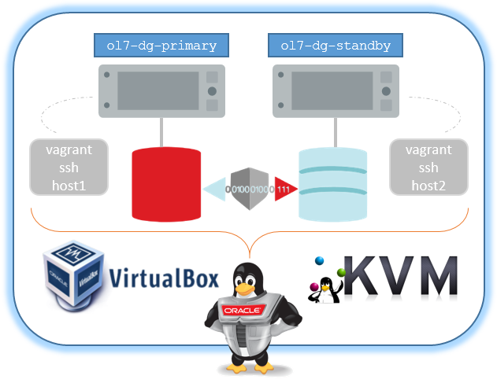

# Oracle Data Guard (DG) Vagrant boxes

#### Author: Ruggero.Citton@oracle.com

This directory contains Vagrant build files to provision automatically
two Oracle RDBMS (18c, 19c) nodes configured with Oracle Data Guard, using Vagrant/VirtualBox, Oracle Linux 7 and shell scripts.

## Prerequisites
1. Install [Oracle VM VirtualBox](https://www.virtualbox.org/wiki/Downloads)
2. Install [Vagrant](https://vagrantup.com/)
3. You need to download Database binary separately.

## Free disk space requirement
  - Database binary zip under "./ORCL_software": ~3.2 Gb
  - Database binary on u01 vdisk (node1/node2): ~10 Gb 
  - OS guest vdisk (node1/node2): ~2 Gb
    - Use `VBoxManage list systemproperties |grep folder` to find out the current VM default location
    - Use `VBoxManage setproperty machinefolder <your path>` to set VM default location
  - Database virtual disks (dynamic size): ~80 Gb

## Memory requirement
Running two RDBMS nodes at least 6Gb per node are required

## VirtualBox host-Only
The guest VMs are using an "host-Only" network defined as 'vboxnet0' 

## Getting started
1. Clone this repository `git clone https://github.com/oracle/vagrant-boxes`
2. Change into OracleDG folder
3. Download Database binary from OTN into "./ORCL_software" folder (*)
4. Run `vagrant up`
5. Connect to the database.
6. You can shut down the box via the usual `vagrant halt` and the start it up again via `vagrant up`.

(*) Download Database binary from OTN into "ORCL_software" folder
https://www.oracle.com/technetwork/database/enterprise-edition/downloads/index.html

    Accept License Agreement
    go to version (18c, 19c) for Linux x86-64 you need -> "See All", example

    * Oracle Database 19c (19.3) for Linux x86-64
       LINUX.X64_193000_db_home.zip (4,564,649,047 bytes)
       (sha256sum - ba8329c757133da313ed3b6d7f86c5ac42cd9970a28bf2e6233f3235233aa8d8)

## Customization
You can customize your Oracle environment by amending the parameters in the configuration file: "./config/vagrant.yml"
The following can be customized:

#### node1/node2
- `vm_name`:    VM Guest partial name. The full name will be <prefix_name>-<vm_name>
- `mem_size`:   VM Guest memory size Mb (minimum 6Gb --> 6144)
- `cpus`:       VM Guest virtual cores
- `public_ip`:  VM public ip. VirtualBox `vboxnet0` hostonly is in use
- `private_ip`: VM private ip.
- `u01_disk`:   Oracle binary virtual disk (u01) file path

#### shared network
- `prefix_name`:    VM Guest prefix name
- `dns_public_ip`:  DNS IP

#### DB storage
- `oradata_disk_path`:  Oradata dbf path
- `oradata_disk_num` :  Oradata number of disks
- `oradata_disk_size`:  oradata disk size (Gb)

#### environment
- `db_software`:      Oracle Database 18c (18.3) for Linux x86-64 zip file
- `root_password`:    VM Guest root password
- `oracle_password`:  VM Guest oracle password
- `sys_password`:     Oracled RDBMS SYS password
- `pdb_password`:     Oracled PDB SYS password
- `ora_languages`:    Oracle products languages
- `db_name`:          Oracle RDBMS database name
- `pdb_name`:         Oracle RDBMS pluggable database name
- `db_type`:          Oracle RDBMS type: RAC, RACONE, SI (single Instance)
- `cdb`:              Oracle RDBMS database created as container (true/false)

#### Example:
  node1:
    vm_name: primary
    mem_size: 8192
    cpus: 2
    public_ip:  192.168.56.131
    private_ip: 192.168.200.131
    u01_disk: ./primary_u01.vdi
  
  node2:
    vm_name: standby
    mem_size: 8192
    cpus: 2
    public_ip:  192.168.56.132
    private_ip: 192.168.200.132
    u01_disk: ./standby_u01.vdi
  
  env:
    box: oraclelinux/7
    url: 'https://oracle.github.io/vagrant-boxes/boxes/oraclelinux-7.json'
    # ---------------------------------------------
    prefix_name:   ol7-dg
    # ---------------------------------------------
    dns_public_ip: 192.168.56.1
    # ---------------------------------------------
    non_rotational: 'on'
    oradata_disk_path:
    oradata_disk_num: 2
    oradata_disk_size: 20
    # ---------------------------------------------
    db_software:     LINUX.X64_193000_db_home.zip
    # ---------------------------------------------
    root_password:   welcome1
    oracle_password: welcome1
    sys_password:    welcome1
    pdb_password:    welcome1
    # ---------------------------------------------
    ora_languages:   en,en_GB
    # ---------------------------------------------
    db_name:         DB193H1
    pdb_name:        PDB1
    cdb:             false
    # ---------------------------------------------

## Running scripts after setup
You can have the installer run scripts after setup by putting them in the `userscripts` directory below the directory where you have this file checked out. Any shell (`.sh`) or SQL (`.sql`) scripts you put in the `userscripts` directory will be executed by the installer after the database is set up and started. Only shell and SQL scripts will be executed; all other files will be ignored. These scripts are completely optional.
Shell scripts will be executed as the root user, which has sudo privileges. SQL scripts will be executed as SYS.
To run scripts in a specific order, prefix the file names with a number, e.g., `01_shellscript.sh`, `02_tablespaces.sql`, `03_shellscript2.sh`, etc.

## Note

- `SYSTEM_TIMEZONE`: `automatically set (see below)`
  The system time zone is used by the database for SYSDATE/SYSTIMESTAMP.
  The guest time zone will be set to the host time zone when the host time zone is a full hour offset from GMT.
  When the host time zone isn't a full hour offset from GMT (e.g., in India and parts of Australia), the guest time zone will be set to UTC.
  You can specify a different time zone using a time zone name (e.g., "America/Los_Angeles") or an offset from GMT (e.g., "Etc/GMT-2"). For more information on specifying time zones, see [List of tz database time zones](https://en.wikipedia.org/wiki/List_of_tz_database_time_zones).

- If you are behing a proxy, set the following env variables

#### (Linux/MacOSX)
  - export http_proxy=http://proxy:port
  - export https_proxy=https://proxy:port

#### (Windows)
  - set http_proxy=http://proxy:port
  - set https_proxy=https://proxy:port
